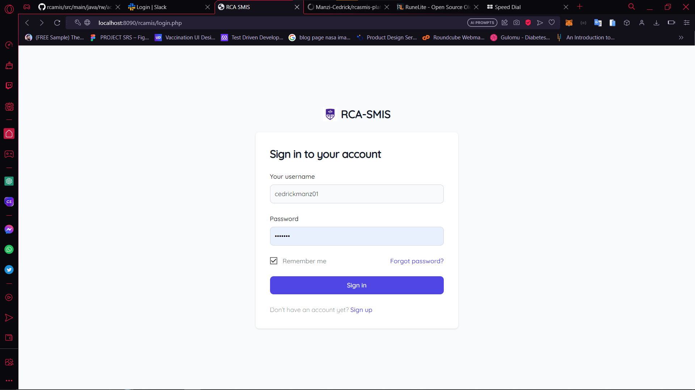
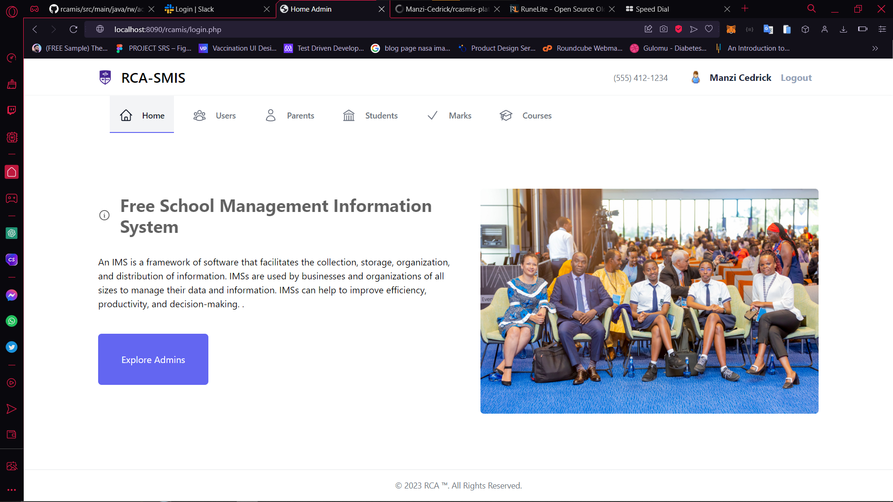
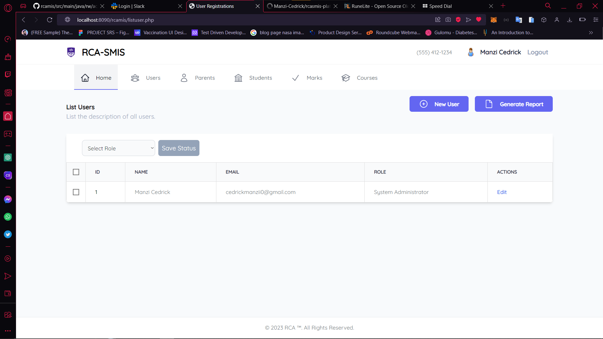
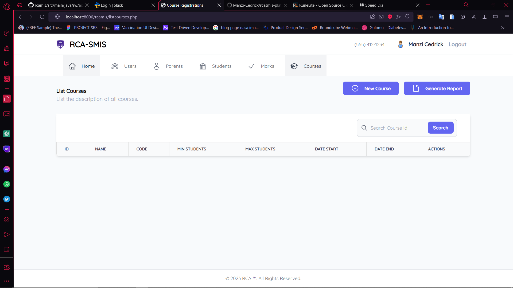

RCA System Information System 
---

# Description
RCA System Information System is a web-based application developed in Java and JSP, designed to assist in the root cause analysis of various incidents or issues. The system aims to provide a centralized platform for recording, analyzing, and resolving problems within an organization.

# Features
* User Authentication:The system supports user registration and login functionality to ensure secure access.
* Incident Recording: Users can create new incidents, providing details such as incident type, description, and associated data.
* Investigation Workflow: The system guides users through a step-by-step investigation workflow, enabling them to gather relevant information and document their findings.
* Root Cause Analysis: Users can perform root cause analysis on incidents, identifying the underlying causes and documenting their conclusions.
* Collaboration: The system facilitates collaboration among team members by allowing them to comment on incidents, share information, and work together towards resolution.
* Reporting: RCA System Information System generates comprehensive reports summarizing incident details, investigation progress, and root cause analysis outcomes.
Technologies Used
* Java: The core programming language used for developing the backend logic and business rules.
* JSP (JavaServer Pages): Used for creating dynamic web pages, rendering data from the server-side.
* Tomcat: The web server used for deploying and running the Java-based web application.
* MySQL: The database management system employed for storing incident data, user information, and other relevant records.
* HTML/CSS: Used for designing and styling the user interface of the web application.
* TailwindCSS: Latest Styling library for better and fast ui.
# Installation and Setup
To set up the RCA System Information System on your local environment, please follow these steps:

* Install Java Development Kit (JDK) if not already installed. Make sure the JAVA_HOME environment variable is properly configured.
* Install Apache Tomcat web server.
* Install MySQL database server and create a new database for the application.
* Clone the project repository from GitHub: repository_url.
* Open the project in your preferred Java Integrated Development Environment (IDE).
* Update the database configuration in the config.properties file to match your local MySQL setup.
* Build the project and generate the WAR (Web Application Archive) file.
* Deploy the WAR file to the Tomcat server.
* Start the Tomcat server and ensure it's running without any errors.
* Access the application in your web browser using the provided URL.
# Usage
Once the RCA System Information System is set up and running, follow these steps to utilize its functionality:

* Open your web browser and enter the application URL.
* Register a new user account or log in with existing credentials.
* Explore the dashboard and available features.
* Create new incidents and provide relevant information.
* Follow the investigation workflow, documenting progress and findings.
* Perform root cause analysis and document the identified causes.
* Collaborate with team members by commenting on incidents and sharing information.
* Generate reports to summarize incident details and analysis outcomes.
# Contributing
Contributions to the RCA System Information System are welcome. If you wish to contribute, please follow these steps:

* Fork the repository on GitHub.
* Create a new branch with a descriptive name for your feature or bug fix.
* Make the necessary code changes and ensure they adhere to the project's coding standards.
* Test your changes thoroughly to ensure they function as intended.
* Commit your changes and push them to your forked repository.
* Create a pull request on the original repository, explaining your changes in detail.
# License
This project is licensed under the MIT License.

# Contact
For any inquiries or support regarding the RCA System Information System, please contact:

Name: Manzi Cedrick
Email: cedrickmanzii0@gmail.com

--- 

